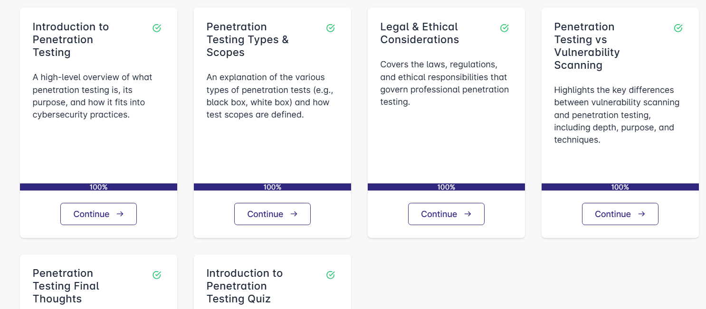

# 🕵️‍♂️ Introduction to Penetration Testing – SecurityBlueTeam  

This repository includes structured **notes, labs, artifacts (report templates, checklists), extras, and certificate** from the **“Introduction to Penetration Testing”** course by **SecurityBlueTeam**.  
It’s built as a complete learning & documentation resource to help you understand penetration testing end-to-end.

---

## 📚 Notes  

- 📝 [`01-introduction.md`](./notes/01-introduction.md) – Introduction & course foundations  
- 📝 [`02-reconnaissance.md`](./notes/02-reconnaissance.md) – Recon techniques  
- 📝 [`03-scanning-enumeration.md`](./notes/03-scanning-enumeration.md) – Scanning & enumeration  
- 📝 [`04-exploitation.md`](./notes/04/exploitation.md) – Exploitation methods  
- 📝 [`05-post-exploitation.md`](./notes/05-post-exploitation.md) – Post-exploitation  
- 📝 [`06-reporting.md`](./notes/06-reporting.md) – Reporting & remediation  

---

## 🧪 Labs  

- 💻 [`01-recon-lab.md`](./labs/01-recon-lab.md) – Reconrealization lab  
- 💻 [`02-scanning-enumeration-lab.md`](./labs/02-scanning-enumeration-lab.md) – Scanning & enumeration lab  
- 💻 [`03-exploitation-lab.md`](./labs/03-exploitation-lab.md) – Exploitation lab  
- 💻 [`04-post-exploitation-lab.md`](./labs/04-post-exploitation-lab.md) – Post-exploitation lab  
- 💻 [`05-reporting-lab.md`](./labs/05-reporting-lab.md) – Pen test report writing lab  

---

## 📋 Artifacts  

- 📄 [`checklist.md`](./artifacts/checklist.md) – Pen test checklist  
- 📄 [`pen-test-report-template.md`](./artifacts/pen-test-report-template.md) – Report template  
- 📄 [`vulnerability-findings-sample.md`](./artifacts/vulnerability-findings-sample.md) – Sample findings  

---

## 📖 Documentation  

- 📘 [`glossary.md`](./docs/glossary.md) – Key definitions  
- 📘 [`index.md`](./docs/index.md) – Course overview & guide  
- 📘 [`references.md`](./docs/references.md) – References & resources  
- 📘 [`roadmap.md`](./docs/roadmap.md) – Learning roadmap  
- 📘 [`syllabus.md`](./docs/syllabus.md) – Course modules & outcomes  

---

## 🔬 Extras  

- 📄 [`case-studies.md`](./extras/case-studies.md) – Real-world attacker cases  
- 📄 [`resources.md`](./extras/resources.md) – External learning resources  
- 📄 [`timeline.md`](./extras/timeline.md) – Study timeline & milestones  

---

## 📸 Screenshots  

| Section         | Screenshot |
|------------------|------------|
| Course Intro     |  |
| Course Details   |  |

---

## 📜 Certificate  

📄 [`Introduction to Penetration Testing-course.pdf`](./cert/Introduction%20to%20Penetration%20Testing-course.pdf)  

---

## 🗣️ Personal Review  

The **Introduction to Penetration Testing** course from **SecurityBlueTeam** offers a well-structured path from foundations to hands-on exploitation and reporting.  
- ✅ Strong balance between theory and labs  
- ✅ Emphasis on methodology and processes  
- ⚠️ Requires basic familiarity with CLI & networking  

Highly recommended for security learners wanting hands-on penetration testing skills.  

---

## ✍️ Author  

**Thành Danh** – Red Team Learner & Security Researcher  

- GitHub: [@ngvuthdanhh](https://github.com/ngvuthdanhh)  

- Email: ngvu.thdanh@gmail.com  

---

## 📄 License  

This project is under the **MIT License**. See [LICENSE](./LICENSE) for details.  
© 2025 Nguyen Vu Thanh Danh. All rights reserved.  
